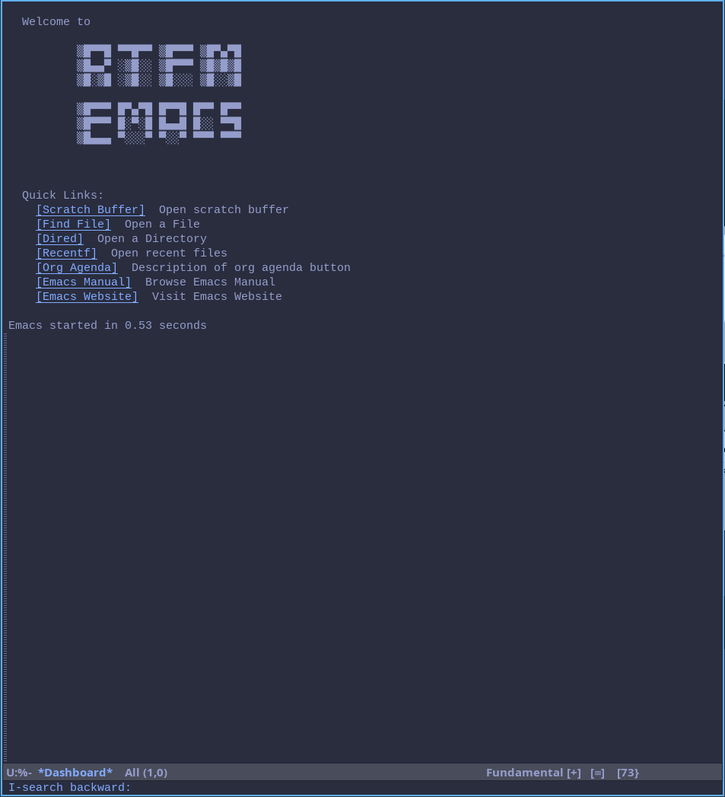

# RTFM emacs

It is my emacs personal emacs config which I have refactored to make
use of built in emacs features. I had to do this due to the
environment I work in.

It has a split configuration in which:

  + rtfm.org makes use of built in emacs features and elisp code I write.
  + pluggedin.org just includes configuration for packages I make use of
  + and finally server.org is for starting emacs-server after init

# It Uses

  + completion-at-point, icomplete and/or fido for completion

  + snippeting using tempo.el and expand.el you just choose which one
  you like by commenting the header for which one you prefer

  + nerdfonts just because I like it

  + etc ...

